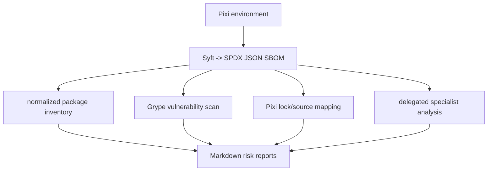

# SBOM Analysis

A repeatable workflow for generating SPDX software bills of materials (SBOMs) for Pixi environments and reviewing dependency risk.

The repository combines:

> Interactive visualizations require [FrameJS](https://framejs.io/) to be installed.

- **Pixi** for reproducible `openfe` and `openff` environments
- **Syft** for SPDX SBOM generation
- **Grype** for vulnerability scanning
- Optional **OSV-Scanner** coverage
- Small dependency-free Python scripts for normalization and triage
- An agent skill for delegated license, provenance, native dependency, removal, and environment-split analysis

## Environments

[`pixi.toml`](pixi.toml) defines two environments:

- `openfe`, rooted at `openfe==1.12.0`
- `openff`, rooted at `openff-toolkit==0.18.1`

The resolved dependency graph is recorded in [`pixi.lock`](pixi.lock).

## Workflow



### SBOM generation

GitHub Actions generates SBOMs on pushes to `main` for both environments. See [`.github/workflows/generate_sbom.yaml`](.github/workflows/generate_sbom.yaml).

The workflow scans `.pixi/envs/<environment>` with Syft and uses [`syft.yaml`](syft.yaml) to enable Conda and Cargo-auditable-binary catalogers. The resulting artifacts are named `openfe.spdx.json` and `openff.spdx.json`.

To generate an SBOM locally with Syft:

```sh
syft .pixi/envs/openfe -o spdx-json=./openfe.spdx.json
syft .pixi/envs/openff -o spdx-json=./openff.spdx.json
```

Use the repository configuration when needed:

```sh
syft .pixi/envs/openfe -c syft.yaml -o spdx-json=./openfe.spdx.json
```

### Inventory and scanner output

Create a normalized inventory:

```sh
python3 scripts/spdx_package_inventory.py \
  --input openfe.spdx.json \
  --output reports/package-inventory.csv
```

Run Grype and preserve its raw JSON output:

```sh
grype openfe.spdx.json -o json > reports/grype-openfe.json
```

Create the vulnerability triage report:

```sh
python3 scripts/vulnerability_risk_report.py \
  --grype-json reports/grype-openfe.json \
  --inventory reports/package-inventory.csv \
  --sbom openfe.spdx.json \
  --output reports/vulnerability-risk.md
```

The scripts keep scanner findings auditable and flag common false-positive patterns such as CPE-only matches, duplicate package records, and wrong-ecosystem advisories.

### Additional analysis

The remaining reports are produced from the inventory, SBOM, lockfile, manifests, and existing reports:

- [`scripts/deduplication_analysis.py`](scripts/deduplication_analysis.py) — duplicate and multiple-version review
- [`scripts/dependency_source_map.py`](scripts/dependency_source_map.py) — maps packages to Pixi roots and environments
- Agent skill — license, provenance, native/binary, removal, environment split, risk model, and executive summary reviews

Run deduplication analysis with:

```sh
python3 scripts/deduplication_analysis.py \
  --input reports/package-inventory.csv \
  --output reports/deduplication-analysis.md
```

The source mapping script reads `pixi.toml`, `pixi.lock`, and `reports/package-inventory.csv`, then writes:

- `reports/dependency-source-map.csv`
- `reports/dependency-source-summary.md`

## Agent skill

The workflow definition is [`.agents/skills/sbom-risk-analysis/SKILL.md`](.agents/skills/sbom-risk-analysis/SKILL.md).

It instructs an agent to:

1. Inspect an SPDX JSON document
2. Generate the normalized inventory
3. Run available vulnerability scanners
4. Delegate independent analysis tasks when supported
5. Combine the results into `dependency-risk-summary.md`

The reusable delegation prompts are in [`.agents/skills/sbom-risk-analysis/references/subagent-goals.md`](.agents/skills/sbom-risk-analysis/references/subagent-goals.md).

The skill is an analysis playbook rather than a standalone scanner. The current GitHub workflow automates SBOM generation; the deeper risk-report generation can be run by an agent or locally using the scripts and reports as inputs.

## Report set

Reports are normally written under `reports/`:

- `package-inventory.csv`
- `deduplication-analysis.md`
- `vulnerability-risk.md`
- `license-risk.md`
- `dependency-source-map.csv`
- `dependency-source-summary.md`
- `removal-candidates.md`
- `environment-split-recommendations.md`
- `provenance-risk.md`
- `native-dependency-risk.md`
- `dependency-risk-model.md`
- `dependency-risk-summary.md`

Raw Grype JSON and text output should remain alongside the reports for traceability.

## Interpretation guidelines

Scanner output is evidence for triage, not proof that a vulnerability is exploitable. Review findings in the context of:

- Package ecosystem and build source
- Runtime versus development or optional dependencies
- CPE-only and cross-ecosystem matches
- Missing PURLs, suppliers, or download locations
- The intended license and redistribution model

Do not claim a package is unused without checking actual project usage or dependency paths.
